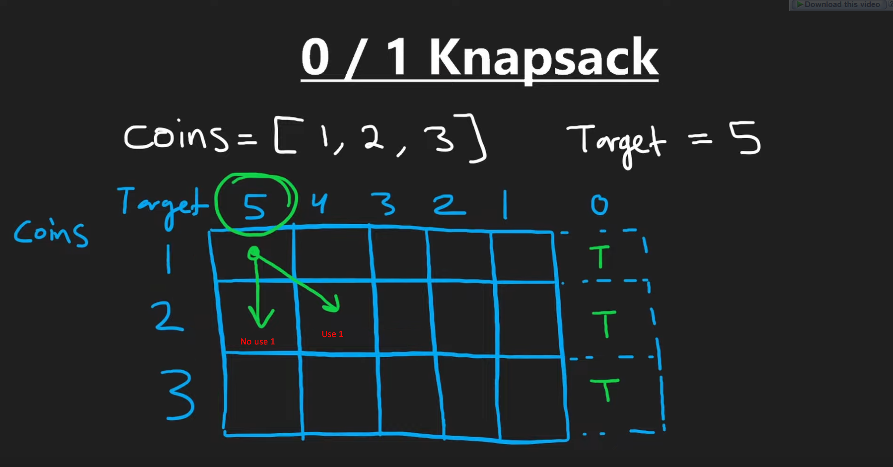
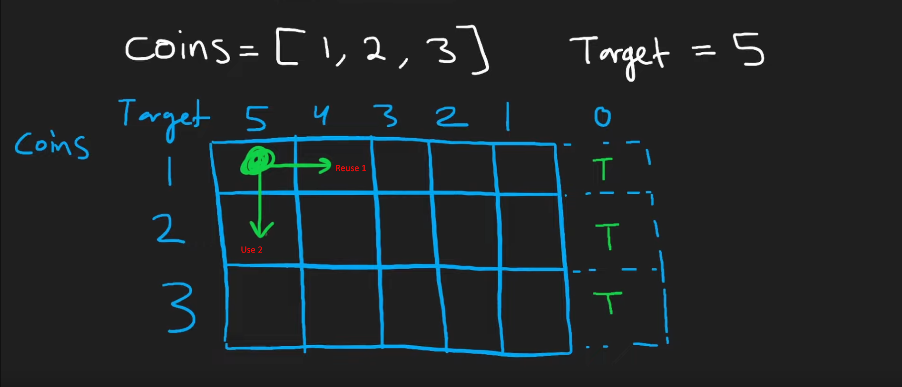
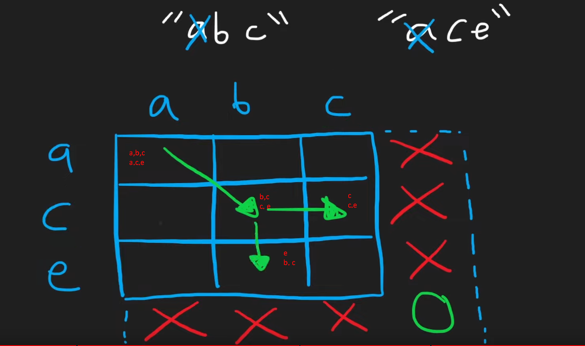

# Dynamic Programming

## Top 5 patterns

> https://www.youtube.com/watch?v=mBNrRy2_hVs&t=308s

### Fibonacci

- Fibonacci
    - base cases:
        - f(0) = 0
        - f(1) = 1
    - formula: f(n) = f(n - 1) + f(n - 2) (n >= 2)
- Decision tree:
    - f(6) = f(5) + f(4)
    - f(5) = f(4) + f(3)
    - f(4) = f(3) + f(2)
    - .....
    - => many duplicates => can save the result for reuse
- Bottom up approach: Calculate from base case -> requirements
- 1D: 1 slice to save the data

### 0/1 knapsack

- using 0/1 of each given element to reach the target
- example: given [1, 2, 3] => sum = 5
    - use each element once or not
    - 
- 2D: nested slice to save the data

### Unbounded knapsack

- using inf of each given element to reach the target
- 2D: nested slice
- 

### Longest Common Subsequence (LCS)

- Example: 2 strings -> LCS
    - 
- 2D

### Palindromes

- Example: given a string, count all palidrome
    - naive: check all sub-string
    - dp: start from a character & expand to 2 directions
        - only check both characters in 2 directions

> ***NOTE***: 2D, goes in the opposite direction of the graph (can get pre-computed values)